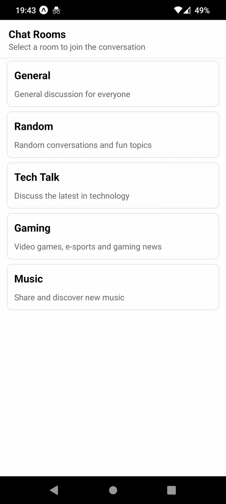
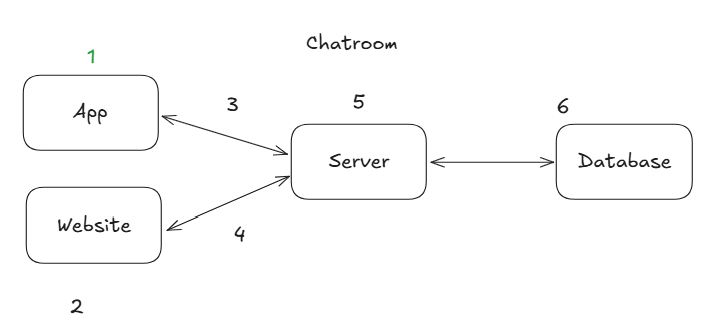

# Chat Room with React Native and Expo

This is a demo chat application built using [React Native](https://reactnative.dev/) and [Expo](https://expo.dev/).



## Getting Started

Follow these steps to run the project locally:

1. **Install dependencies**

   ```bash
   npm install
   ```

2. **Start the development server**

   ```bash
   npx expo start
   ```

   You can then open the app on your device using the Expo Go app, or run it on an emulator.

## Project Overview

This app is part 1 of a larger project with the following architecture:



---
